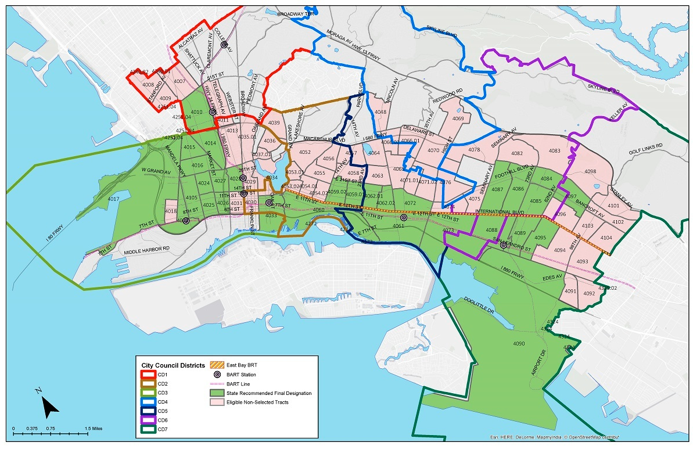
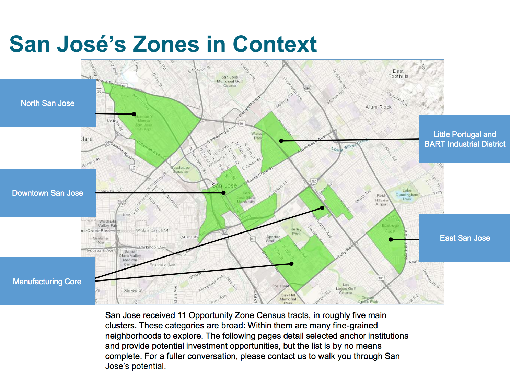

# opportunity-zone

## What is Opportunity Zone

A. An Opportunity Zone is an economically-distressed community where new investments, under certain conditions, may be eligible for preferential tax treatment. Localities qualify as Opportunity Zones if they have been nominated for that designation by the state and that nomination has been certified by the Secretary of the U.S. Treasury via his delegation of authority to the Internal Revenue Service.

## To Qualify Opportunity Zone Fund

To become a Qualified Opportunity Fund and invest in eligible property located in an Opportunity Zone, you should self-certify. (In other words, no approval or action by the IRS is required.) To self-certify, you must complete a form (to be released in the summer of 2018) and attach that form to your federal income tax return for the taxable year. See 8996 forms in 
Resources.

A few important things:
* Qualified Opportunity Zone business property is tangible property used in the business that is located in the opportunity zone purchased by the qualified Opportunity Zone fund after 12/31/17.

* The Opportunity Fund must hold at least 90% of its assets in qualified Opportunity Zone property.

* If the tangible property ceases to be qualified Opportunity Zone business property, then it will continue to be treated as qualified Opportunity Zone business property for the lesser of 1) Five years after the date on which it ceased to be qualified or 2) the date on which it is no longer held by the qualified Opportunity Zone business.

## Opportunity Zone Oakland

## Opportunity Zone San Jose

## Resources

[IRS 8996 Form](https://www.irs.gov/pub/irs-access/f8996_accessible.pdf)

[IRS 8996 Form Instruction](https://www.irs.gov/pub/irs-pdf/i8996.pdf)

[IRS Opportunity Zone FAQ](https://www.irs.gov/newsroom/opportunity-zones-frequently-asked-questions)

[Opportunity Zone Oakland](https://www.oaklandca.gov/resources/designated-opportunity-zones)

[Opportunity Zone San Jose](http://vtaorgcontent.s3-us-west-1.amazonaws.com/Site_Content/OZone-OED-Prospectus-020419.pdf)

[List of Opportunity Zones in xlsx](https://www.cdfifund.gov/Documents/Designated%20QOZs.12.14.18.xlsx)
